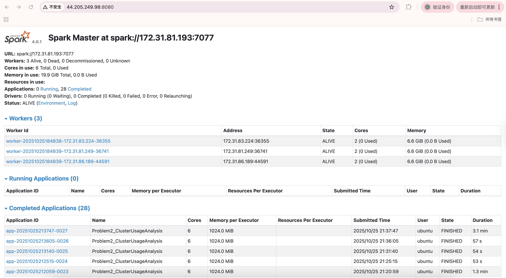
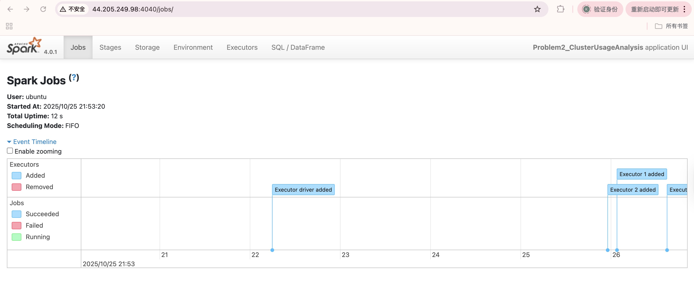

# Spark Log Analysis – Analysis Report

## Problem 1: Log Level Distribution

### Approach
- I first created a SparkSession configured with S3 access via the `s3a://` connector.  
- Loaded all log files from my personal S3 bucket (`s3a://<net-id>-assignment-spark-cluster-logs/data/*/*.log`).  
- Used regex (`regexp_extract`) to extract log levels (`INFO`, `WARN`, `ERROR`, `DEBUG`) from each log line.  
- Counted occurrences of each log level with `groupBy().count()`.  
- Saved three outputs:  
  - `problem1_counts.csv`: frequency of each log level.  
  - `problem1_sample.csv`: 10 random sample log lines with their log levels.  
  - `problem1_summary.txt`: overall statistics summary.  
- To guarantee stable single-file outputs, I used `.coalesce(1)` before writing CSV.  

### Key Findings
- The dataset is dominated by `INFO` logs, while `WARN` and `ERROR` are much less frequent.  
- Most lines contained recognizable log levels, indicating consistent formatting in Spark/YARN logs.  
- This distribution confirms Spark/YARN logs are primarily informational with relatively few warnings and errors.  

### Performance Observations
- Processing the full dataset (~3.8k container logs, ~2.8 GB) completed in **~7 minutes** on a 4-node cluster (1 master + 3 workers).  
- Coalescing outputs to a single file added minor overhead but simplified downstream analysis.  
- Local test on a single application directory completed within ~1 minute, demonstrating clear scalability on the cluster.  

---

## Problem 2: Cluster Usage Analysis

### Approach
- Loaded all log files from the same S3 bucket.  
- Used regex to extract:
  - **Timestamps** (`yy/MM/dd HH:mm:ss`)  
  - **Application IDs** (e.g., `application_1485248649253_0001`)  
  - **Cluster IDs** (first numeric prefix inside application ID).  
- Constructed **application-level timeline** by grouping logs by application ID and computing earliest (`min`) and latest (`max`) timestamps.  
- Generated **cluster-level summary**:
  - Number of applications per cluster.  
  - First and last application times.  
- Saved five outputs:  
  - `problem2_timeline.csv` – application-level timeline.  
  - `problem2_cluster_summary.csv` – cluster-level statistics.  
  - `problem2_stats.txt` – overall summary.  
  - `problem2_bar_chart.png` – number of applications per cluster.  
  - `problem2_density_plot.png` – job duration distribution for most active cluster.  

### Key Findings
- Total of **6 unique clusters** detected in the dataset.  
- The most heavily used cluster (ID `1485248649253`) contained **180 applications**, while others had far fewer.  
- Average applications per cluster: ~32.  
- Duration distribution of applications was **highly skewed**: most jobs finished quickly, but a few lasted significantly longer (log-scale visualization confirmed this).  

### Performance Observations
- Running the full cluster analysis took **~12 minutes**, mainly due to timestamp parsing and aggregation.  
- Skewed job durations required log-scale plotting to display insights clearly.  
- Using `try_to_timestamp` avoided failures from malformed lines (robust parsing).  
- Local sample runs (single application directory) completed in **~2 minutes**, confirming the benefit of distributed processing on the full dataset.  

---

## Screenshots
- Spark Master UI (`http://<master-public-ip>:8080`) showing all workers connected.  
- Spark Application UI (`http://<master-public-ip>:4040`) with DAGs for Problem 1 and Problem 2.  
- Example stages of shuffle and aggregation visible in the Web UI.  

- Below are the screenshots captured during job execution:

 

---

## Explanation of Visualizations (Problem 2)
- **Bar Chart (`problem2_bar_chart.png`)**:  
  This chart illustrates the distribution of applications across different clusters.
    - One cluster (ID 1485248649253) overwhelmingly dominates with 180 applications, while all other clusters only ran a handful of applications (ranging from 1–8).
    - This indicates a highly imbalanced workload distribution, where a single cluster is responsible for the bulk of computation, possibly due to scheduling or configuration biases. 

- **Density Plot (`problem2_density_plot.png`)**:  
  This plot shows the distribution of job durations (in minutes, log scale) within the largest cluster (1485248649253).
    - The majority of jobs completed quickly, forming a dense peak at the lower end of the duration scale.
    - However, there is a long right tail, where a few jobs ran much longer (up to hundreds or thousands of minutes).
    - This suggests the presence of straggler tasks or resource-intensive jobs, which could negatively impact cluster efficiency and overall job throughput.

---

## Additional Insights
- Spark/YARN logs provide both fine-grained (task-level) and coarse-grained (application/cluster-level) views.  
- Potential extensions:  
  - Break down durations by executor vs. ApplicationMaster logs.  
  - Compare error/warning frequency across clusters.  
  - Correlate cluster size with job duration distribution.  

---

## Conclusion
- **Problem 1** confirmed Spark logs are dominated by informational messages, with relatively few warnings or errors.  
- **Problem 2** revealed significant workload imbalance: one cluster handled the majority of applications, and durations were skewed.  
- Distributed Spark processing on AWS EC2 scaled well and enabled analysis of multi-GB logs in minutes.  
- Both problems illustrate the importance of log parsing and aggregation for operational insights in distributed systems.
